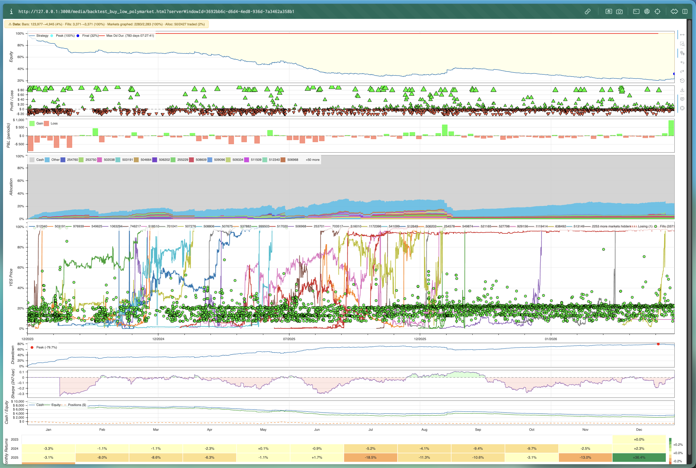

# prediction-market-backtesting

[](https://github.com/evan-kolberg/prediction-market-backtesting/actions/workflows/ci.yml)
[](https://www.python.org/downloads/)
[](https://www.rust-lang.org/)
[](LICENSE)
[](https://github.com/astral-sh/ruff)
[](https://github.com/astral-sh/uv)
[](https://duckdb.org)


An event-driven backtesting engine for prediction market trading strategies. Replays historical trades from [Kalshi](https://kalshi.com) and [Polymarket](https://polymarket.com) in chronological order, simulating order fills, portfolio tracking, and market lifecycle events. The hot loop (broker, portfolio, lifecycle) is compiled to native code via [PyO3](https://pyo3.rs) while strategy callbacks remain in Python. Inspired by [NautilusTrader](https://github.com/nautechsystems/nautilus_trader), plotting inspired by [minitrade](https://github.com/dodid/minitrade).

Take a look at some example graphs below. Losing money has never looked so good.

[--> Click here for an interactive demo <--](https://evan-kolberg.github.io/prediction-market-backtesting/media/backtest_buy_low_polymarket.html) ```buy_low.py``` as of engine date: Fri Feb 27, 2026 commit #39

[--> Click here for another <--](https://evan-kolberg.github.io/prediction-market-backtesting/media/backtest_gambling_addiction_kalshi.html) ```gambling_addiction.py``` as of engine date: Fri Feb 27, 2026 commit #39



Built on top of [prediction-market-analysis](https://github.com/Jon-Becker/prediction-market-analysis) for data indexing and analysis.

### Table of Contents

- [Roadmap](#roadmap)
- [Current issues](#current-issues)
- [Prerequisites](#prerequisites)
- [Setup](#setup-created-on-macos)
  - [1. Clone the repo](#1-clone-the-repository)
  - [2. Install dependencies](#2-install-dependencies)
  - [3. Build the engine](#3-build-the-engine)
  - [4. Download the data](#4-download-the-data)
  - [5. Run a backtest](#5-run-a-backtest)
  - [6. Front test](#6-front-test-live-paper-trading)
- [Available Commands](#available-commands)
- [Writing a Strategy](#writing-a-strategy)
  - [Strategy API](#strategy-api)
  - [Lifecycle Hooks](#lifecycle-hooks)
  - [Properties](#properties)
- [Data](#data)
- [How the Engine Works](#how-the-engine-works)
- [License](#license)

## Roadmap

- [x] **Interactive charts** — Bokeh-based HTML charts with linked equity curve, P&L, market prices, drawdown, and cash panels
- [x] **Slippage, latency, & liquidity modeling** — taker-side-aware fill logic, price-proportional spread cost, and square-root market impact
- [x] **Front-testing** — paper trade strategies against live WebSocket data from Polymarket (Kalshi coming soon); auto-selects ~30 active markets with real-time price/volume display
- [ ] **Assess backtesting engine validity** - It'll  be a good idea to validate the quality of this engine with fronttesting
- [ ] **Front-testing** - more work has to be done on allowing the user to have more control over how the front-testing works. An arbitrary number of 30 markets will soon need to be variable since strategies come in all types.
- [ ] **Market filtering** — filter by market type, category, or specific market IDs
- [ ] **Advanced order types** — market orders, stop-losses, take-profit, and time-in-force options

## Current issues

- [ ] High memory usage (42 GB when loading top 1% volume Polymarket data). The bulk of memory comes from the data feed and plotting pipeline — further work needed on streaming/chunked processing.
- [ ] Kalshi front testing is not yet available — requires API credential wiring and has not been verified end-to-end.
- [ ] More testing of the backtesting engine must be done in order to verify its claims


## Prerequisites

- Python 3.9+
- [uv](https://docs.astral.sh/uv/) — fast Python package manager `brew install uv`
- [zstd](https://github.com/facebook/zstd) — required for data decompression `brew install zstd`
- [GNU Make](https://www.gnu.org/software/make/) - needed for using makefiles `brew install make`
- [Rust](https://rustup.rs/) — required for the compiled engine `curl --proto '=https' --tlsv1.2 -sSf https://sh.rustup.rs | sh`

## Setup (created on macOS)
> It is still entirely possible to run this on Windows & Linux, but the terminal commands will look different. Until they are fully supported, I recommend you use something like Claude Code or GitHub Copilot to handle the initial setup on your system.

### 1. Clone the repository

```bash
git clone --recurse-submodules https://github.com/evan-kolberg/prediction-market-backtesting.git
cd prediction-market-backtesting
```

If you already cloned without `--recurse-submodules`:

```bash
git submodule update --init --recursive
```

### 2. Install dependencies

uv manages virtual environments automatically — no manual activation needed. Each project (root and submodule) has its own `pyproject.toml` and isolated environment. uv resolves and installs dependencies on first `uv run`.

```bash
uv sync
```

### 3. Build the engine

```bash
make build-rust
```

> **Note:** Requires a Rust toolchain ([rustup](https://rustup.rs/)) and [maturin](https://www.maturin.rs/) (`pip install maturin` or `uv pip install maturin`).

### 4. Download the data

This downloads and extracts the historical trade dataset (~36 GB compressed, ~53.57 uncompressed) into the submodule's `data/` directory. A symlink at the root points there.

```bash
make setup
```

> **Note:** This step installs `zstd` and `aria2c` if not already present (via Homebrew on macOS or apt on Linux), then downloads and extracts the dataset. You only need to do this once.

### 5. Run a backtest

```bash
make backtest
```

This launches an interactive menu where you select a strategy, platform, and market sample size. Results are printed to the terminal and an event log is saved to `output/`.

<p>
  
  
</p>

To run a specific strategy directly:

```bash
make backtest <strat_name>
```

### 6. Front test (live paper trading)

```bash
make fronttest
```

This connects to live WebSocket feeds and paper trades your strategy against real-time market data. No real money is used — fills are simulated using the same matching logic as the backtest engine.

Currently **Polymarket** is the active platform. Kalshi support is coming soon.

When you select Polymarket and press Enter (without typing condition IDs), the engine automatically fetches ~30 active markets sorted by 24-hour volume, displays a table of each market's current YES price, 24h volume, and close date, then begins streaming live trades across all of them simultaneously.

> This is still a work-in-progress. Don't trust these.


Press **Ctrl+C** at any time to stop — a full session summary (P&L, fills, win rate) is printed on exit.

To run a specific strategy directly:

```bash
make fronttest <strat_name>
```

## Available Commands

| Command | Description |
|---|---|
| `make backtest [name]` | Run a backtest interactively or by strategy name |
| `make fronttest [name]` | Front test a strategy against live market data (paper trading) |
| `make build-rust` | Compile the engine |
| `make setup` | Initialize submodule and download trade data |
| `make test` | Run the test suite |
| `make lint` | Check code style with Ruff |
| `make format` | Auto-format code with Ruff |

Any target not defined in the root Makefile is forwarded to the [prediction-market-analysis](https://github.com/Jon-Becker/prediction-market-analysis) submodule:

| Command | Description |
|---|---|
| `make index` | Build/rebuild DuckDB indexes over the raw parquet data |
| `make analyze` | Run the full analysis suite and write results to `output/` |
| `make package` | Package analysis outputs for distribution |

## Writing a Strategy

Create a new file in `src/backtesting/strategies/` and subclass `Strategy`:

```python
from src.backtesting.models import TradeEvent
from src.backtesting.strategy import Strategy


class MyStrategy(Strategy):
    def __init__(self, initial_cash: float = 10_000.0):
        super().__init__(
            name="my_strategy",
            description="Description shown in the menu",
            initial_cash=initial_cash,
        )

    def on_trade(self, trade: TradeEvent) -> None:
        """Called for every historical trade event."""
        if trade.yes_price < 0.10:
            self.buy_yes(trade.market_id, price=0.10, quantity=10.0)
```

Strategies are auto-discovered — drop a `.py` file in the `strategies/` directory and it appears in the backtest menu.

### Strategy API

| Method | Description |
|---|---|
| `buy_yes(market_id, price, quantity)` | Place a limit buy on YES contracts |
| `buy_no(market_id, price, quantity)` | Place a limit buy on NO contracts |
| `sell_yes(market_id, price, quantity)` | Place a limit sell on YES contracts |
| `sell_no(market_id, price, quantity)` | Place a limit sell on NO contracts |
| `cancel_order(order_id)` | Cancel a pending order |
| `cancel_all(market_id=None)` | Cancel all pending orders |

### Lifecycle Hooks

| Hook | When it fires |
|---|---|
| `initialize()` | Once before the simulation starts |
| `on_trade(trade)` | Every historical trade event |
| `on_fill(fill)` | When one of your orders fills |
| `on_market_open(market)` | When a market's open time is reached |
| `on_market_close(market)` | When a market's close time is reached |
| `on_market_resolve(market, result)` | When a market resolves to YES or NO |
| `finalize()` | Once after the simulation ends |

### Properties

| Property | Description |
|---|---|
| `self.portfolio` | Current portfolio snapshot (cash, equity, positions) |
| `self.open_orders` | List of currently pending orders |
| `self.markets` | All available market metadata |


## Data

Historical trade data is sourced from the [prediction-market-analysis](https://github.com/Jon-Becker/prediction-market-analysis) project. The dataset is stored as parquet files and queried via DuckDB.

| Platform | Data |
|---|---|
| Kalshi | Markets metadata + individual trades with prices in cents (1–99) |
| Polymarket | On-chain CTF Exchange trade executions (OrderFilled events from Polygon) joined with block timestamps. Not CLOB order book data — only filled trades are available. |

## How the Engine Works

Trades replay chronologically. For each trade, the engine checks pending orders for fills, updates the portfolio, then fires `on_trade` so the strategy can react. The hot loop (order matching, portfolio math) is compiled Rust; strategy callbacks are Python.

A limit buy fills when two things are true:
- **price:** the trade price is at or below your limit
- **taker side:** the taker is on the sell side; you won't fill against another buyer lifting the ask

Slippage has two components on top of a configurable base fee (default 0.5%):
- **spread cost:** scales with distance from 50%; around 1¢ near even odds, up to 5–10¢ near 5%/95%
- **market impact:** square-root scaling off a per-market EMA of trade sizes, so a 4x oversized order costs 2x, not 4x

The goal of the slippage model is to punish strategies that only look good under perfect-fill assumptions. It's easy to create optimistic backtests, so it's important to stay conservative. Work is being done to allow strategies to be tested in real-time with fronttesting.

## License

This project is licensed under the MIT License. See [LICENSE](LICENSE) for details.

---

## Star History

<a href="https://www.star-history.com/#evan-kolberg/prediction-market-backtesting&type=date&legend=top-left">
 <picture>
   <source media="(prefers-color-scheme: dark)" srcset="https://api.star-history.com/svg?repos=evan-kolberg/prediction-market-backtesting&type=date&theme=dark&legend=top-left" />
   <source media="(prefers-color-scheme: light)" srcset="https://api.star-history.com/svg?repos=evan-kolberg/prediction-market-backtesting&type=date&legend=top-left" />
   
 </picture>
</a>
